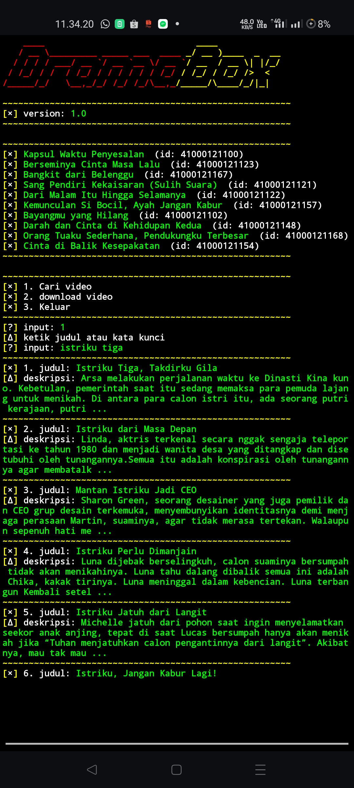
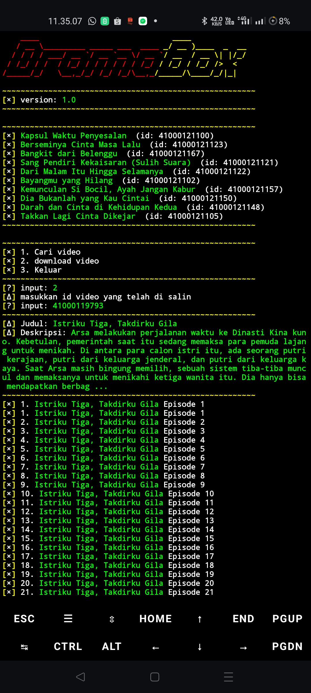

<p align="center"> 
  
</p>

<p align="center">
  


<p align="center">  
  <strong>cari judul</strong>  
</p>  
<p align="center">  
    
</p>  <p align="center">  
  <strong>download episode</strong>  
</p>  
<p align="center">  
    

## 🚀 Install and Run

Untuk menginstal dan menjalankan script DramaBox ini, ikuti langkah-langkah berikut:
install modul yang di butuhkan 
```sh
pkg install git -y
pip install requests
pip install pycryptodome
```
jalanin scriptnya 
```sh
git clone --depth=1 https://github.com/FIRandZAH/DramaBox
cd DramaBox
python DramaBox.py
```


##  🤝  Hubungi saya

Butuh bantuan atau ada pertanyaan?  Silakan hubungi saya melalui:

* **WhatsApp:** https://wa.me/6283170597744
* **Email:** [firzah48@gmail.com](mailto:firzah48@gmail.compipil.compip
